DashPro is an ecommerce website for selling dashcams and its related products. This project is built using React, Express.js, MongoDB,
Node.js. Here React is used to build the frontend and Express.js with Node.js for the backend with a MongoDB database in connection.
In the frontend part redux toolkit is used to manage state globally and to make RTK queries to the backend. Authentication system using
JWT tokens is built into DashPro.

Features:
There are basically 2 types of users who can use this web application. Firstly the noraml users. They can:

- register
- login and logout
- view homepage with products
- search products
- view product detail page
- add to cart by customozing parameters like quantity
- checkout by adding shipping address, payment method
- add reviews when logged in
- edit profile
- view their ordres and their status

There is also another user type who is admin. They can:

- all the functions of a normal user
- add,edit and delete products
- add, edit and delete users
- modify orders

Some Pictures of DashPro demonstrating differnet features can be found below:
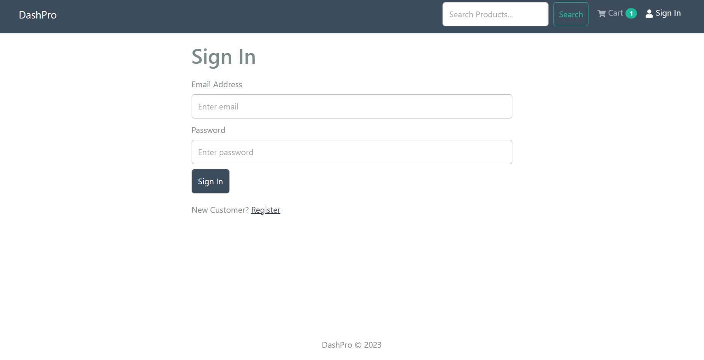
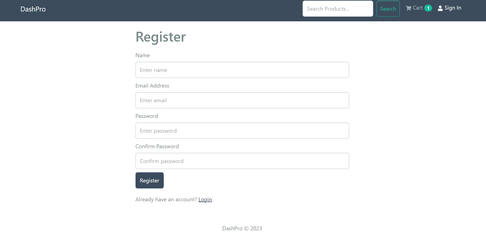
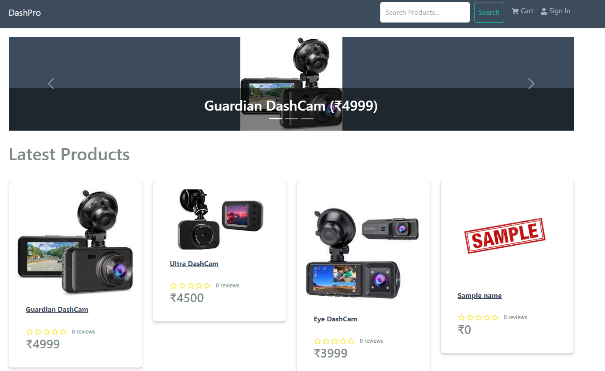
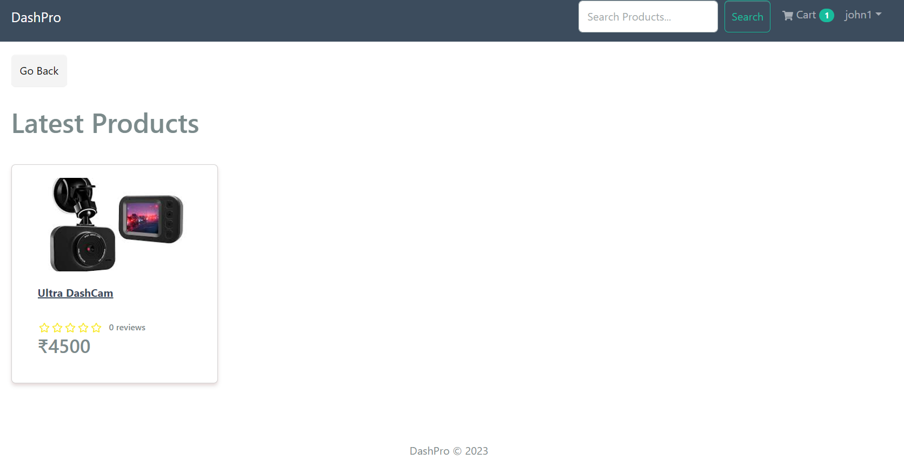
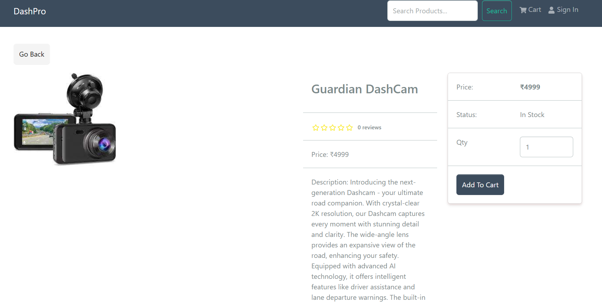
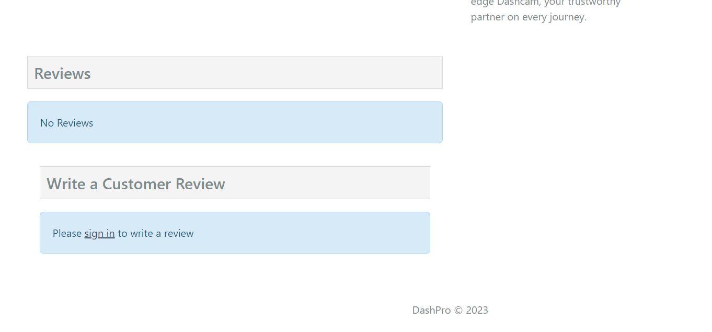

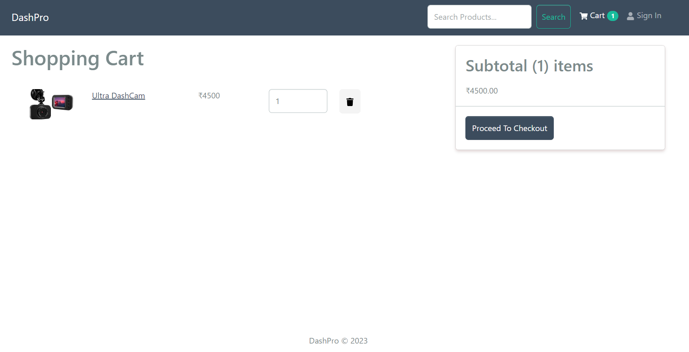
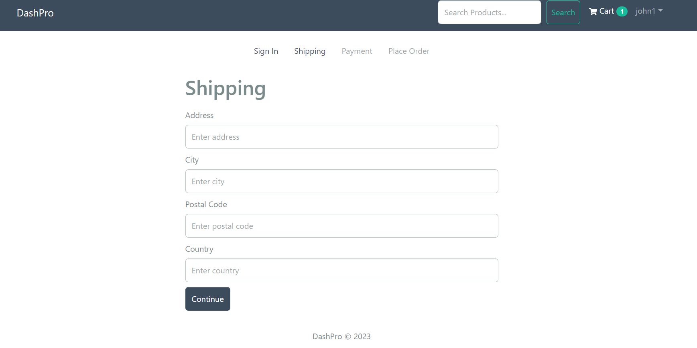
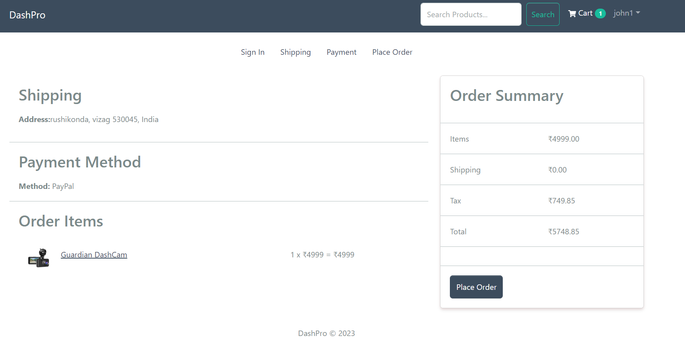
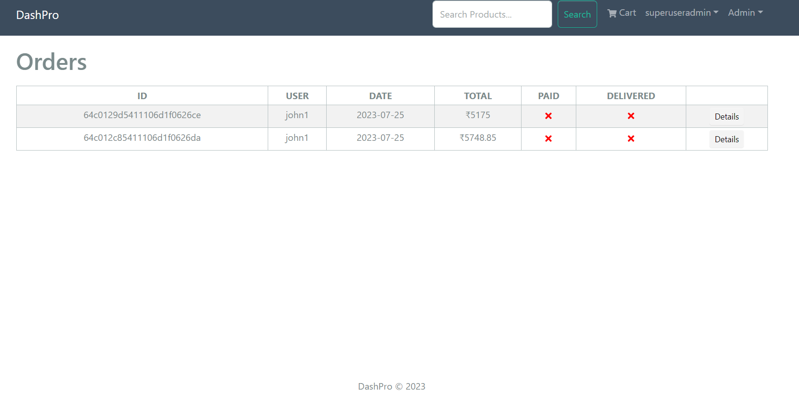
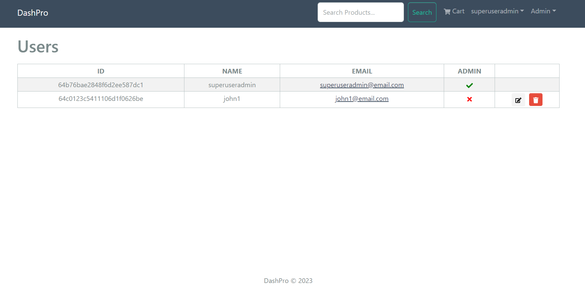
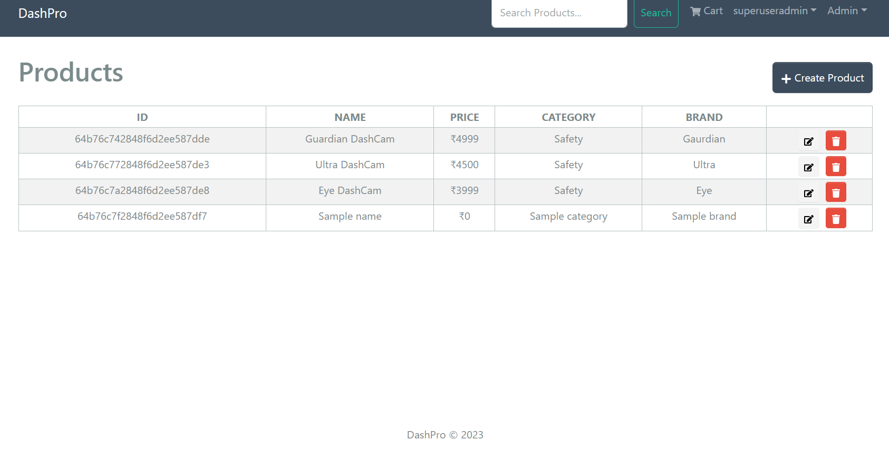
